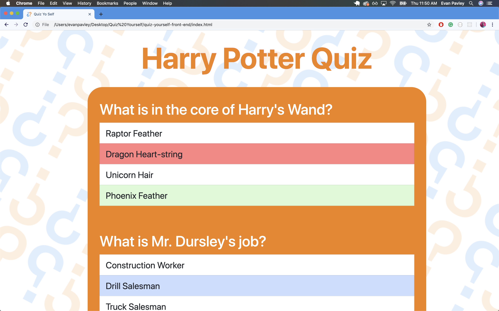
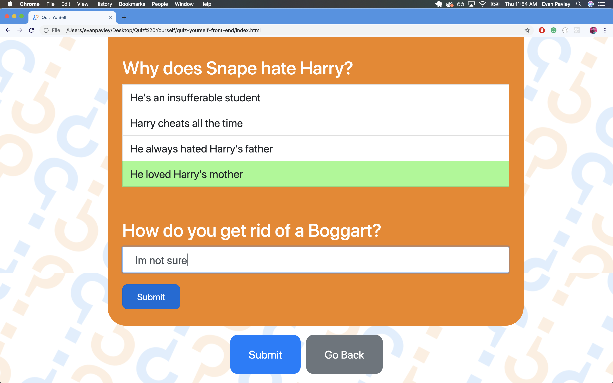

[Demo Video](https://www.youtube.com/watch?v=9026WDePVPs)

Test your own and your friends’ knowledge with Quiz Yourself, the quiz creation web-app.
Created by Evan Pavley and Zeshawn Kahn.

## Features

Users can view created quizzes that are stored in the database.

Then take the quizzes with multiple choice and fill in the blank questions that tell you when you get them wrong or right.

After your done taking the quiz you can see the percentage you got correct.

## Built With

* [JavaScript ES6](https://developer.mozilla.org/en-US/docs/Web/JavaScript) - used to configured the front-end api with many event listeners
* [BootStrap](https://getbootstrap.com/) - implemented to streamline responsive styling
* [Ruby on Rails](https://rubyonrails.org/) - to save created quizzes in a **has_many** domain model

## Additional Notes

Evan Pavley designed the logo and repeating pattern background.

[Backend Repo](https://github.com/EvanPavley/quiz-yourself-back-end)
